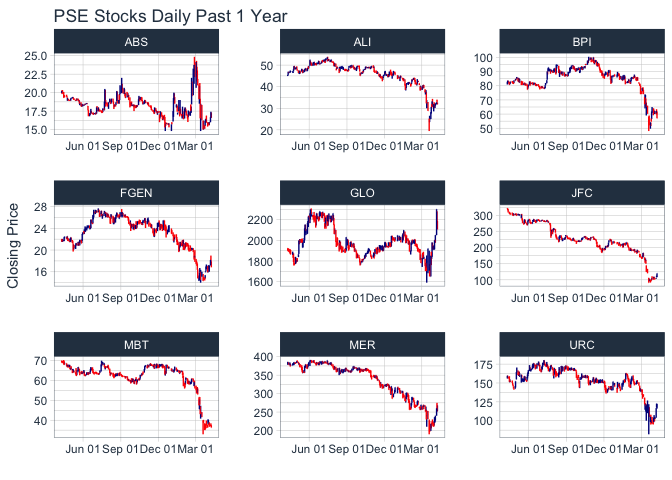

<!-- README.md is generated from README.Rmd. Please edit that file -->
pseR
====

Pull and analyse PSE data. Currently limited only to Investagrams as source which is limited to past year data only.

Installation
------------

Install devtools to easily install `pseR`.

``` r
install.packages("devtools")
devtools::install_github("nfrimando/pseR")
```

Examples
--------

Extract historical PSE data with `pse_get()`

``` r
suppressPackageStartupMessages({library(pseR); library(dplyr)}) 
stock.dt <- pse_get(c("JFC", "MBT", "FGEN","BPI", "URC",
                            "ALI", "MER", "ABS", "GLO"))
stock.dt %>% head()
```

    ##   code       date close change  open   low  high
    ## 1  JFC 2020-04-17 145.0    3.5 142.0 141.4 147.0
    ## 2  JFC 2020-04-16 141.5   -7.1 147.0 137.4 147.0
    ## 3  JFC 2020-04-15 148.6    2.1 150.0 143.5 152.1
    ## 4  JFC 2020-04-14 146.5   11.5 139.9 139.8 148.0
    ## 5  JFC 2020-04-13 135.0   15.0 121.0 121.0 136.1
    ## 6  JFC 2020-04-08 120.0    9.5 111.0 108.1 120.0

Analytics using `tidyquant`
---------------------------

The package [`tidyquant`](https://cran.r-project.org/web/packages/tidyquant/vignettes/TQ04-charting-with-tidyquant.html) has convenient functions that allows easy implementation for visualisation and analysis. (It also has functions to pull data for PSE from various sources. The easy-to-access sources though are usually not updated. E.g. Yahoo! Finance).

``` r
suppressPackageStartupMessages({library(tidyquant); library(ggplot2)})
stock.dt %>%
  ggplot(aes(x = as.Date(date), y = close)) +
  geom_barchart(aes(open = open, high = high, low = low, close = close)) +
  labs(title = "PSE Stocks Daily Past 1 Year", y = "Closing Price", x = "") + 
  facet_wrap(~code, scales = "free") + 
  scale_x_date(date_breaks = "3 months", date_labels = "%b %d") + 
  theme_tq()
```


