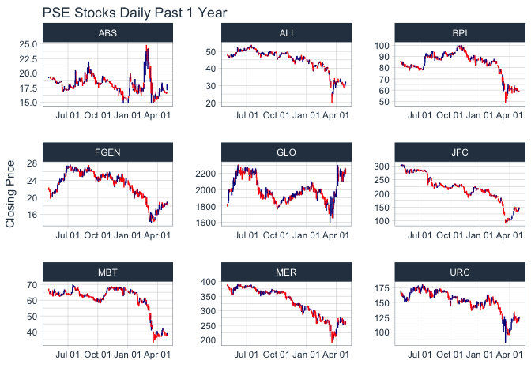

<!-- README.md is generated from README.Rmd. Please edit that file -->
pseR
====

Pull and analyse PSE data. Currently limited only to Investagrams as source which is limited to past year data only.

Installation
------------

Install devtools to easily install `pseR`.

``` r
install.packages("devtools")
devtools::install_github("nfrimando/pseR")
```

Examples
--------

Extract historical PSE data with `pse_get()`

``` r
suppressPackageStartupMessages({library(pseR); library(dplyr)}) 
stock.dt <- pse_get(c("JFC", "MBT", "FGEN","BPI", "URC",
                            "ALI", "MER", "ABS", "GLO"))
stock.dt %>% head()
```

    ##   code       date close change perc_change  open   low  high
    ## 1  JFC 2020-04-30 143.1   -3.9       -2.65 148.0 143.0 149.0
    ## 2  JFC 2020-04-29 147.0    5.8        4.11 141.2 139.1 147.0
    ## 3  JFC 2020-04-28 141.2    6.7        4.98 136.0 135.6 141.4
    ## 4  JFC 2020-04-27 134.5    0.2        0.15 135.0 134.3 136.5
    ## 5  JFC 2020-04-24 134.3   -1.7       -1.25 137.8 133.7 137.8
    ## 6  JFC 2020-04-23 136.0    2.0        1.49 137.0 135.5 140.0

Analytics using `tidyquant`
---------------------------

The package [`tidyquant`](https://cran.r-project.org/web/packages/tidyquant/vignettes/TQ04-charting-with-tidyquant.html) has convenient functions that allows easy implementation for visualisation and analysis. (It also has functions to pull data for PSE from various sources. The easy-to-access sources though are usually not updated. E.g. Yahoo! Finance).

``` r
suppressPackageStartupMessages({library(tidyquant); library(ggplot2)})
stock.dt %>%
  ggplot(aes(x = as.Date(date), y = close)) +
  geom_barchart(aes(open = open, high = high, low = low, close = close)) +
  labs(title = "PSE Stocks Daily Past 1 Year", y = "Closing Price", x = "") + 
  facet_wrap(~code, scales = "free") + 
  scale_x_date(date_breaks = "3 months", date_labels = "%b %d") + 
  theme_tq()
```



Correlation Visualisation with `ggcorrplot`
-------------------------------------------

``` r
suppressPackageStartupMessages({library(tidyr); library(ggcorrplot)})
stock.dt %>%
  group_by(code) %>% 
  arrange(desc(date)) %>% 
  # filter(row_number() <= 150) %>% 
  ungroup() %>% 
  select(code, date, perc_change) %>% 
  spread(key = code, value = perc_change) %>% 
  select(-date) %>% 
  cor() %>% 
  ggcorrplot(
    hc.order = TRUE, 
    type = "lower",
    outline.col = "white",
    ggtheme = ggplot2::theme_gray,
    colors = c("#6D9EC1", "white", "#E46726"),
    insig = "blank",
    lab = TRUE,
    lab_size = 6
  )
```


